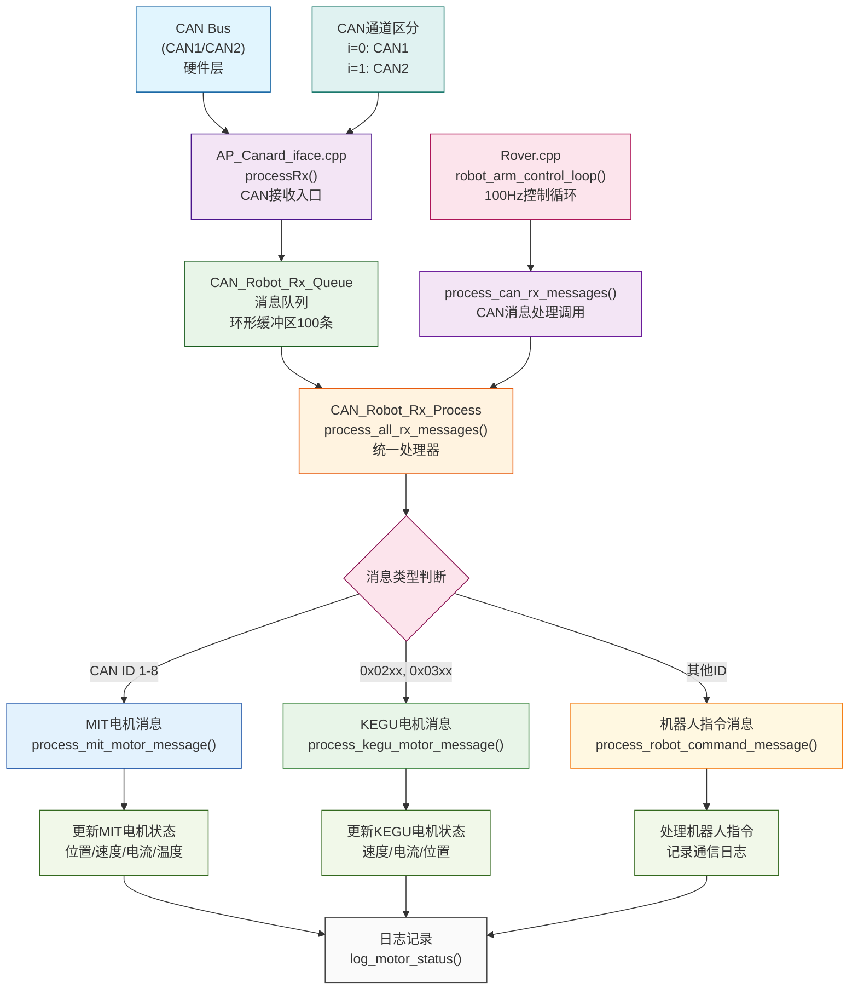

# CAN 机器人接收系统架构文档

## 概述

本文档描述了Pixhawk CAN机器人接收系统的清晰架构设计，该系统负责处理来自CAN1和CAN2总线的机器人相关消息，包括MIT电机反馈、KEGU电机反馈和其他机器人通信消息。

## 系统架构

### 架构图



**简化架构图**：
```
CAN Bus (CAN1/CAN2)
         ↓
AP_Canard_iface.cpp (processRx)
         ↓
CAN_Robot_Rx_Queue (消息队列)
         ↓
CAN_Robot_Rx_Process (统一处理器)
         ↓
Rover.cpp (robot_arm_control_loop)
```

### 数据流程

1. **CAN消息接收**: CAN总线上的消息被硬件接收
2. **消息预处理**: `AP_Canard_iface.cpp` 接收并推送到队列
3. **队列缓存**: `CAN_Robot_Rx_Queue` 暂存消息，区分CAN1/CAN2
4. **消息处理**: `CAN_Robot_Rx_Process` 统一处理所有消息类型
5. **状态更新**: 更新电机状态和系统状态
6. **调用入口**: `Rover.cpp` 在100Hz控制循环中调用处理

## 文件结构

### 核心文件组织

```
libraries/CAN_Robot_Rx/
├── CAN_Robot_Rx_Queue.h          # 消息队列接口
├── CAN_Robot_Rx_Queue.cpp        # 队列实现（单例模式）
├── CAN_Robot_Rx_Process.h        # 统一消息处理器接口
└── CAN_Robot_Rx_Process.cpp      # 处理器实现（单例模式）

libraries/AP_DroneCAN/
└── AP_Canard_iface.cpp           # CAN接收入口（已修改）

Rover/
├── Rover.cpp                     # 主控制循环（已修改）
└── Rover.h                       # 函数声明（已修改）
```

## 详细模块说明

### 1. CAN_Robot_Rx_Queue（消息队列）

**职责**: 消息存储和管理

**关键特性**:
- 环形缓冲区，大小100条消息
- 线程安全（使用信号量保护）
- 区分CAN通道（0=CAN1, 1=CAN2）
- 统计信息（接收/丢弃/分通道计数）

**核心接口**:
```cpp
struct CANRxMessage {
    uint32_t can_id;        // CAN ID
    uint8_t can_channel;    // CAN通道 (0=CAN1, 1=CAN2)
    uint8_t dlc;           // 数据长度
    uint8_t data[8];       // 数据内容
    uint64_t timestamp_us; // 接收时间戳
};

bool push_message(const CANRxMessage& msg);    // 推送消息
bool get_next_message(CANRxMessage& msg);      // 获取消息
void mark_message_processed(void);            // 标记已处理
```

### 2. CAN_Robot_Rx_Process（统一处理器）

**职责**: 所有CAN消息的解析和处理

**支持的消息类型**:
- MIT电机反馈消息（CAN ID 1-8）
- KEGU电机反馈消息（ID模式: 0x02xx, 0x03xx）
- 其他机器人通信消息

**电机状态管理**:
```cpp
struct MIT_Motor_Feedback {
    float position;         // 位置 (度)
    float velocity;         // 速度 (RPM)
    float current;          // 电流 (A)
    float temperature;      // 温度 (°C)
    uint8_t error_code;     // 错误代码
    uint64_t last_update_us; // 最后更新时间
};

struct KEGU_Motor_Feedback {
    float speed;            // 速度 (RPM)
    float current;          // 电流 (mA)
    int32_t position;       // 位置 (脉冲)
    uint8_t status;         // 状态标志
    uint64_t last_update_us; // 最后更新时间
};
```

**核心处理流程**:
```cpp
void process_all_rx_messages(void) {
    while (有消息) {
        if (MIT电机消息) → process_mit_motor_message()
        else if (KEGU电机消息) → process_kegu_motor_message()
        else → process_robot_command_message()
        
        mark_message_processed()
        限制单次处理数量(20条)
    }
    log_motor_status()  // 定期记录状态
}
```

### 3. AP_Canard_iface.cpp（CAN接收入口）

**修改内容**: 在`processRx()`函数中添加消息推送逻辑

**关键代码**:
```cpp
// Push CAN message to robot rx queue - 区分不同CAN口
CAN_Robot_Rx_Queue* rx_queue = CAN_Robot_Rx_Queue::get_singleton();
if (rx_queue != nullptr) {
    CAN_Robot_Rx_Queue::CANRxMessage can_msg;
    can_msg.can_id = rxmsg.id;
    can_msg.can_channel = i;  // i=0为CAN1, i=1为CAN2
    can_msg.dlc = AP_HAL::CANFrame::dlcToDataLength(rxmsg.dlc);
    memcpy(can_msg.data, rxmsg.data, can_msg.dlc);
    can_msg.timestamp_us = timestamp;
    rx_queue->push_message(can_msg);
}
```

### 4. Rover.cpp（控制循环集成）

**调用位置**: `robot_arm_control_loop()` (100Hz)

**集成代码**:
```cpp
void Rover::process_can_rx_messages() {
    // 初始化（仅执行一次）
    static bool rx_initialized = false;
    if (!rx_initialized) {
        CAN_Robot_Rx_Queue::init();
        CAN_Robot_Rx_Process::init();
        rx_initialized = true;
    }
    
    // 处理消息
    CAN_Robot_Rx_Process* rx_processor = CAN_Robot_Rx_Process::get_singleton();
    if (rx_processor != nullptr) {
        rx_processor->process_all_rx_messages();
    }
}
```

## 消息处理详情

### MIT电机消息解析

**CAN ID**: 1-8 (对应电机编号)
**数据格式**: 
- Byte 0: 命令类型
- Byte 1-4: 32位数据值（小端格式）

**支持的命令**:
- `0x06`: 速度反馈 (0.01 RPM分辨率)
- `0x08`: 位置反馈 (0.01度分辨率)  
- `0x04`: 电流反馈 (mA分辨率)
- `0x32`: 温度反馈

### KEGU电机消息解析

**CAN ID格式**: 0xTTMM (TT=消息类型, MM=电机ID)
**消息类型**:
- `0x02`: 速度和电流反馈
- `0x03`: 位置反馈

**数据格式**:
- 速度/电流消息: 4字节速度 + 2字节电流
- 位置消息: 4字节位置值

## 性能特性

### 实时性保证
- **单次处理限制**: 最多20条消息/次，防止阻塞控制循环
- **100Hz调用频率**: 与机器人控制循环同步
- **队列大小**: 100条消息缓冲，应对突发流量

### 线程安全
- **信号量保护**: 队列操作使用HAL_Semaphore
- **单例模式**: 全局唯一实例，避免资源竞争
- **原子计数**: 使用volatile变量保护计数器

### 监控和调试
- **统计信息**: 消息计数、队列状态、错误统计
- **详细日志**: 每条消息的完整信息记录
- **状态汇总**: 定期(10秒)记录系统状态
- **电机状态**: 实时更新各电机的位置、速度、电流等

## 扩展指南

### 添加新的电机类型
1. 在`CAN_Robot_Rx_Process.h`中添加新的反馈结构
2. 在`is_xxx_motor_id()`中添加ID识别逻辑
3. 实现对应的`process_xxx_motor_message()`函数
4. 在`process_all_rx_messages()`中添加分发逻辑

### 添加新的消息处理器
如果消息类型很多，可以考虑创建专门的处理器类：
```cpp
class CAN_Robot_Servo_Handler {
    // 专门处理舵机消息
};
```

### 性能优化建议
- 如果消息量很大，可以考虑使用专门的线程处理
- 可以根据消息优先级进行分级处理
- 对于关键消息，可以实现快速路径处理

## 故障排查

### 常见问题
1. **消息丢失**: 检查队列是否满、处理速度是否跟上
2. **CAN通道混乱**: 确认`can_channel`设置正确
3. **电机数据异常**: 检查消息解析逻辑和数据格式
4. **性能问题**: 监控单次处理消息数量和处理时间

### 调试方法
1. **日志分析**: 查看详细的消息处理日志
2. **统计监控**: 定期检查队列状态和处理统计
3. **状态检查**: 使用`get_xxx_motor_status()`获取实时状态
4. **队列状态**: 监控`get_queue_size()`避免溢出

## 总结

该架构具有以下优势：
- **清晰的职责分工**: 队列、处理、调用各司其职
- **良好的扩展性**: 易于添加新的消息类型和处理器
- **高可靠性**: 线程安全、错误处理、状态监控齐全
- **高性能**: 实时性保证、资源优化使用
- **易于维护**: 代码结构清晰、文档完整

这个架构为机器人CAN通信提供了稳定、高效、可扩展的解决方案。 