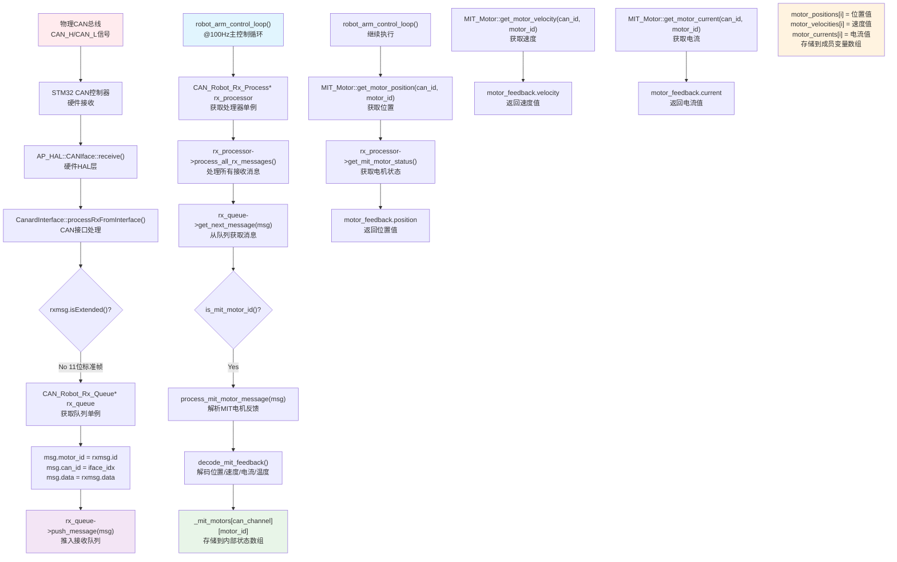

# CAN Robot 接收数据流程完整分析

## 概述

本文档详细分析了从物理CAN总线接收电机状态数据，到主控制循环(`robot_arm_control_loop`)获取位置、速度、电流信息的完整数据流程。整个过程涉及硬件接收、队列缓存、消息解析、数据存储和应用层获取等多个环节。

## 数据流程图



## 详细流程分析

### 1. CAN硬件接收阶段

**位置**: `libraries/AP_DroneCAN/AP_Canard_iface.cpp`  
**函数**: `CanardInterface::processRxFromInterface(uint8_t iface_idx)`

```cpp
// Push CAN message to robot rx queue - 明确标识CAN接口
CAN_Robot_Rx_Queue* rx_queue = CAN_Robot_Rx_Queue::get_singleton();
if (rx_queue != nullptr) {
    CAN_Robot_Rx_Queue::CANRxMessage msg;   // 队列专用格式
    msg.motor_id = rxmsg.id;        // MIT电机ID (CAN消息ID对应motor_id)
    msg.can_id = iface_idx;         // CAN总线ID：0=CAN1, 1=CAN2
    msg.dlc = AP_HAL::CANFrame::dlcToDataLength(rxmsg.dlc);  // 数据长度
    memcpy(msg.data, rxmsg.data, msg.dlc);  // 数据
    msg.timestamp_us = timestamp;  // 时间戳    
    rx_queue->push_message(msg);
}
```

**关键功能**:
- **原始信号**: `AP_HAL::CANFrame rxmsg` - 从物理CAN口接收的原始帧
- **接口识别**: `iface_idx` 标识是CAN1(0)还是CAN2(1)
- **消息转换**: 将硬件CAN帧转换为队列专用的 `CANRxMessage` 格式
- **队列推送**: 调用 `rx_queue->push_message(msg)` 将消息放入接收队列

### 2. 消息队列缓存阶段

**位置**: `libraries/CAN_Robot_Rx/CAN_Robot_Rx_Queue.h`

**队列数据结构**:
```cpp
struct CANRxMessage {
    uint32_t motor_id;      // MIT电机ID (原CAN消息ID)
    uint8_t can_id;         // CAN总线ID (0=CAN1, 1=CAN2)
    uint8_t dlc;           // 数据长度
    uint8_t data[8];       // 数据内容
    uint64_t timestamp_us; // 接收时间戳(微秒)
};
```

**队列特性**:
- **缓冲大小**: 100个消息的环形缓冲区 (`CAN_RX_QUEUE_SIZE = 100`)
- **线程安全**: 支持多线程并发访问
- **统计信息**: 记录接收总数、丢弃数、各CAN总线计数
- **内存管理**: 使用环形缓冲区避免内存碎片

### 3. 消息处理阶段

**位置**: `Rover/Rover.cpp`  
**函数**: `robot_arm_control_loop()` (100Hz主控制循环)

```cpp
// Process all messages from the queue using Rx processor
CAN_Robot_Rx_Process* rx_processor = CAN_Robot_Rx_Process::get_singleton();
if (rx_processor != nullptr) {
    rx_processor->process_all_rx_messages();
}
```

**消息分发处理** (`libraries/CAN_Robot_Rx/CAN_Robot_Rx_Process.cpp`):

```cpp
void CAN_Robot_Rx_Process::process_all_rx_messages(void)
{
    CAN_Robot_Rx_Queue* rx_queue = CAN_Robot_Rx_Queue::get_singleton();
    if (!rx_queue) {
        return;
    }
    
    CAN_Robot_Rx_Queue::CANRxMessage msg;
    uint32_t processed_count = 0;
    
    while (rx_queue->get_next_message(msg)) {
        // 根据Motor ID类型分发消息
        if (is_mit_motor_id(msg.motor_id)) {
            process_mit_motor_message(msg);
        } else if (is_kegu_motor_id(msg.motor_id)) {
            process_kegu_motor_message(msg);
        } else {
            process_robot_command_message(msg);
        }
        
        // 标记消息已处理
        rx_queue->mark_message_processed();
        processed_count++;
        
        // 防止单次处理过多消息影响实时性
        if (processed_count >= 20) {
            break;
        }
    }
}
```

**关键功能**:
- **批量处理**: 一次处理多个消息，提高效率
- **实时性保护**: 限制单次处理消息数量(最多20个)
- **协议识别**: 根据Motor ID自动识别MIT/KEGU电机协议
- **状态管理**: 自动标记消息为已处理状态

### 4. MIT电机数据解码阶段

**位置**: `libraries/CAN_Robot_Rx/CAN_Robot_Rx_Process.cpp`  
**函数**: `decode_mit_feedback()`

```cpp
void CAN_Robot_Rx_Process::decode_mit_feedback(const CAN_Robot_Rx_Queue::CANRxMessage &msg, MIT_Motor_Feedback &feedback)
{
    if (msg.dlc < 5) return; // 数据长度不足
    
    uint8_t cmd = msg.data[0];
    
    // 从数据字节1-4提取32位值（小端格式）
    int32_t raw_value = (msg.data[1] << 0) | (msg.data[2] << 8) | 
                        (msg.data[3] << 16) | (msg.data[4] << 24);
    
    switch (cmd) {
        case 0x06: // 速度反馈
            feedback.velocity = raw_value * 0.6f / 101.0f; // 0.01 RPM 分辨率
            break;
        case 0x08: // 位置反馈
            feedback.position = raw_value * 360.0f / 262144.0f; // 0.01 度分辨率
            break;
        case 0x04: // 电流反馈
            feedback.current = raw_value * 1.0f / 1000.0f; // mA 分辨率转换为 A
            break;
        case 0x32: // 温度反馈
            feedback.temperature = static_cast<float>(raw_value);
            break;
        default:
            // 未知命令，记录错误
            feedback.error_code = cmd;
            break;
    }
}
```

**MIT电机反馈数据结构**:
```cpp
struct MIT_Motor_Feedback {
    float position;     // 位置 (度)
    float velocity;     // 速度 (RPM)
    float current;      // 电流 (A)
    float temperature;  // 温度 (°C)
    uint8_t error_code; // 错误代码
    uint64_t last_update_us; // 最后更新时间
};
```

**关键功能**:
- **协议解析**: 根据命令字节(cmd)解析不同类型的反馈数据
- **数值转换**: 将原始整数值转换为物理单位(度、RPM、安培等)
- **状态存储**: 解析后的数据存储到 `_mit_motors[can_channel][motor_id]` 数组
- **时间戳管理**: 记录最后更新时间，用于数据新鲜度检测

### 5. 数据获取接口阶段

**位置**: `Rover/MIT_Motor.cpp`  
**函数**: `get_motor_position()`, `get_motor_velocity()`, `get_motor_current()`

```cpp
float get_motor_position(uint8_t can_id, uint8_t motor_id)
{
    // Get the CAN Rx processor singleton
    CAN_Robot_Rx_Process* rx_processor = CAN_Robot_Rx_Process::get_singleton();
    if (!rx_processor) {
        return NAN;  // Return NAN to indicate no valid data
    }
    
    // Only process CAN1 messages (channel 0 is CAN1 for motor)
    uint8_t can_channel = 0;  // CAN1
    
    // Get MIT motor status from CAN1
    const CAN_Robot_Rx_Process::MIT_Motor_Feedback& motor_feedback = 
        rx_processor->get_mit_motor_status(can_channel, motor_id);
    
    // Check if we have valid data
    if (motor_feedback.last_update_us > 0) {
        return motor_feedback.position;  // Return position in degrees
    }
    
    return NAN;  // Return NAN to indicate no valid data
}
```

**关键功能**:
- **单例访问**: 通过单例模式获取处理器实例
- **数据验证**: 检查时间戳确保数据有效性
- **错误处理**: 返回NaN表示无效数据
- **通道映射**: 将逻辑CAN_ID映射到物理通道

### 6. 主控制循环数据使用阶段

**位置**: `Rover/Rover.cpp`  
**函数**: `robot_arm_control_loop()` (100Hz频率)

```cpp
// 获取并更新电机状态数据 - 使用类成员变量，高效无重复声明
for (uint8_t i = 0; i < JOINT_MOTOR_COUNT; i++) {
    MotorInstance* m = joint_motor_list[i];
    
    // 为每个电机分别获取状态数据，存储到成员变量数组中
    motor_positions[i] = MIT_Motor::get_motor_position(m->can_id, m->motor_id);
    motor_velocities[i] = MIT_Motor::get_motor_velocity(m->can_id, m->motor_id);
    motor_currents[i] = MIT_Motor::get_motor_current(m->can_id, m->motor_id);
    
    // 只要不是NaN就更新位置值（包括0.0也是有效值）
    if (!isnan(motor_positions[i])) {
        m->last_position = motor_positions[i];
    }
}
```

**关键功能**:
- **批量获取**: 一次获取所有6个关节电机的状态数据
- **成员变量存储**: 存储到类成员数组，避免重复声明
- **数据验证**: 检查NaN值，只使用有效数据
- **状态同步**: 更新电机实例的最后位置值

## 数据结构层次

### 队列层数据结构
```cpp
CAN_Robot_Rx_Queue::CANRxMessage {
    uint32_t motor_id;      // CAN消息ID
    uint8_t can_id;         // CAN总线ID
    uint8_t dlc;           // 数据长度
    uint8_t data[8];       // 原始数据
    uint64_t timestamp_us; // 时间戳
}
```

### 处理层数据结构
```cpp
CAN_Robot_Rx_Process::MIT_Motor_Feedback {
    float position;        // 解析后的位置(度)
    float velocity;        // 解析后的速度(RPM)
    float current;         // 解析后的电流(A)
    float temperature;     // 解析后的温度(°C)
    uint8_t error_code;    // 错误代码
    uint64_t last_update_us; // 最后更新时间
}
```

### 应用层数据结构
```cpp
// Rover类成员变量
float motor_positions[JOINT_MOTOR_COUNT];   // 位置数组
float motor_velocities[JOINT_MOTOR_COUNT];  // 速度数组
float motor_currents[JOINT_MOTOR_COUNT];    // 电流数组
```

## 关键特性总结

### 1. 实时性保证
- **100Hz主控制循环**: 确保数据及时处理和更新
- **批量处理限制**: 单次最多处理20个消息，避免阻塞主循环
- **时间戳验证**: 检测数据新鲜度，避免使用过期信息

### 2. 数据完整性
- **CRC校验**: 硬件层CAN控制器自动进行CRC校验
- **时间戳记录**: 每个消息都带接收时间戳
- **错误检测**: 多层错误检测和处理机制

### 3. 系统可靠性
- **队列缓冲**: 100个消息的环形缓冲区，防止数据丢失
- **线程安全**: 信号量保护，支持多线程并发访问
- **错误恢复**: NaN值表示无效数据，系统继续运行

### 4. 协议适配性
- **多协议支持**: 同时支持MIT和KEGU两种电机协议
- **多总线支持**: 明确区分CAN1和CAN2接口
- **自动识别**: 根据Motor ID自动识别协议类型

### 5. 性能优化
- **单例模式**: 避免重复创建实例，提高效率
- **成员变量缓存**: 减少函数调用开销
- **批量操作**: 一次处理多个消息，提高吞吐量

## 调试和监控

### 日志输出
系统提供多层级日志输出：
- **接收统计**: 总接收数、丢弃数、各CAN总线计数
- **协议解析**: MIT/KEGU电机数据解析详情
- **错误检测**: 无效数据、协议错误等异常情况

### 性能监控
- **处理延迟**: 从接收到处理完成的时间
- **队列状态**: 队列使用率、满队列事件
- **数据新鲜度**: 最后更新时间监控

整个数据流程确保了从物理CAN信号到应用层控制逻辑的高效、可靠传递，为机器人臂的精确控制提供了坚实的数据基础。 