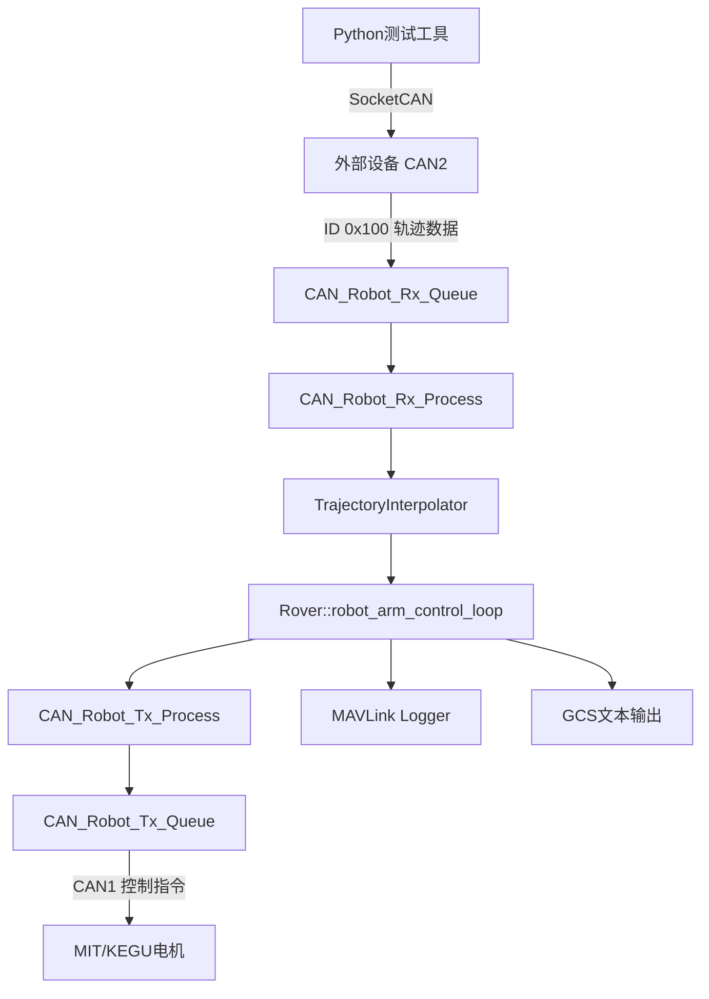

# 新增功能与接口总览（按模块详细展开）

## 主要功能模块表格

| 功能部件 | 技术模块 | 返回值=类/函数名(输入、输出) | 数据(结构体) | 外部接口 | 开发平台及语言 | 调用外部库 | 备注 |
|---------|---------|---------------------------|------------|---------|-------------|-----------|-----|
| 轨迹接收处理 | CAN_Robot_Rx_Process | 类：CAN_Robot_Rx_Process（新增） | CANRxMessage MIT_Motor_Feedback KEGU_Motor_Feedback TrajectoryDataQueue | CAN2 接收轨迹帧(ID 0x100) | ArduPilot Rover，C++ | AP_HAL::CAN DroneCAN 适配 MAVLink Logger | 专门处理机器人CAN消息的处理器 |
|  |  | 静态函数：init(void) → void |  | CAN2 | ArduPilot Rover，C++ | — | 初始化单例 |
|  |  | 静态函数：get_singleton(void) → CAN_Robot_Rx_Process* |  | — | — | — | 获取单例实例 |
|  |  | 成员函数：process_all_rx_messages(void) → void |  | CAN1/CAN2 | — | — | 循环处理所有接收消息 |
|  |  | 成员函数：process_can2_trajectory_command(void) → void |  | CAN2 | — | — | 解析0x100轨迹帧并更新队列 |
|  |  | 成员函数：decode_mit_feedback(const CANRxMessage&, MIT_Motor_Feedback&) → void | MIT_Motor_Feedback | — | — | — | MIT电机反馈解码 |
|  |  | 统计函数：get_mit_message_count(void) → uint32_t |  | — | — | — | MIT消息计数 |
|  |  | 统计函数：get_kegu_message_count(void) → uint32_t |  | — | — | — | KEGU消息计数 |
|  |  | 统计函数：get_command_message_count(void) → uint32_t |  | — | — | — | 命令消息计数 |
| 轨迹接收队列 | CAN_Robot_Rx_Queue | 类：CAN_Robot_Rx_Queue（新增） | CANRxMessage TrajectoryDataQueue | 与Rx_Process配合 | ArduPilot Rover，C++ | AP_HAL::CAN | 接收消息队列管理 |
|  |  | 静态函数：init(void) → void |  | — | — | — | 初始化单例 |
|  |  | 静态函数：get_singleton(void) → CAN_Robot_Rx_Queue* |  | — | — | — | 获取单例实例 |
|  |  | 成员函数：get_queue_size(void) → uint32_t |  | — | — | — | 获取队列长度 |
|  |  | 成员函数：is_queue_full(void) → bool |  | — | — | — | 检查队列是否满 |
|  |  | 成员函数：is_queue_empty(void) → bool |  | — | — | — | 检查队列是否空 |
|  |  | 成员函数：get_total_received(void) → uint32_t |  | — | — | — | 累计接收消息数 |
|  |  | 成员函数：get_total_dropped(void) → uint32_t |  | — | — | — | 累计丢弃消息数 |
|  |  | 成员函数：get_can1_count(void) → uint32_t |  | — | — | — | CAN1通道计数 |
|  |  | 成员函数：get_can2_count(void) → uint32_t |  | — | — | — | CAN2通道计数 |
| 轨迹插值 | TrajectoryInterpolator | 类：TrajectoryInterpolator（新增） | InterpolationParams InterpolationState TrajectoryPoint JointAngles | 上游Rx队列 下游电机指令 | ArduPilot Rover，C++ | 数学函数库 | 轨迹插值器实现 |
|  |  | 成员函数：add_trajectory_point(const TrajectoryPoint&) → bool | TrajectoryPoint | — | — | — | 添加轨迹点到插值队列 |
|  |  | 成员函数：interpolate(float dt) → JointAngles | JointAngles | — | — | — | 输出平滑轨迹参考值 |
| 轨迹/命令发送 | CAN_Robot_Tx_Process | 类：CAN_Robot_Tx_Process（新增） | Mit_Motor_Status KeGu_Motor_Status MotorCommand | 向CAN1发送控制 | ArduPilot Rover，C++ | AP_HAL::CAN | 主发送处理器（单例模式） |
|  |  | 静态函数：init(void) → void |  | CAN1 | — | — | 初始化单例 |
|  |  | 静态函数：get_singleton(void) → CAN_Robot_Tx_Process* |  | — | — | — | 获取单例实例 |
|  |  | 常量访问：get_mit_status(void) const → const Mit_Motor_Status& | Mit_Motor_Status | — | — | — | 读取MIT电机状态 |
|  |  | 常量访问：get_kegu_status(void) const → const KeGu_Motor_Status& | KeGu_Motor_Status | — | — | — | 读取KEGU电机状态 |
| 发送队列 | CAN_Robot_Tx_Queue | 类：CAN_Robot_Tx_Queue（新增） | CAN2_TX_Frame CAN2_TX_Queue MotorCommand | 发帧到CAN1 | ArduPilot Rover，C++ | AP_HAL::CANFrame | 发送队列管理 |
|  |  | 成员函数：push(const AP_HAL::CANFrame&) → bool | CAN2_TX_Frame | — | — | — | 帧入队操作 |
|  |  | 成员函数：pop(AP_HAL::CANFrame&) → bool | CAN2_TX_Frame | — | — | — | 帧出队操作 |
|  |  | 成员函数：is_empty(void) → bool |  | — | — | — | 检查队列是否空 |
|  |  | 成员函数：is_full(void) → bool |  | — | — | — | 检查队列是否满 |
|  |  | 成员函数：size(void) → uint8_t |  | — | — | — | 获取队列大小 |
| 主控循环/初始化 | Rover（机器人臂） | 成员函数：robot_arm_init(void) → void | JointAngles MotorInstance PositionQueue RobotArmConfig IKSolutions Pose | — | ArduPilot Rover，C++ | MAVLink Logger GCS 文本宏 | 机械臂系统初始化 |
|  |  | 成员函数：kegu_motor_init(void) → void |  | — | — | — | KEGU电机专用初始化 |
|  |  | 成员函数：robot_arm_control_loop(void) → void |  | CAN Rx/Tx/插值 | — | — | 主控制循环（双臂、夹爪） |
|  |  | 成员函数：dual_arm_init(void) → void |  | — | — | — | 双臂系统初始化 |
|  |  | 成员函数：update_arm_status(uint8_t arm_id) → void |  | — | — | — | 更新单个机械臂状态 |
|  |  | 成员函数：process_arm_interpolation(uint8_t arm_id) → void |  | — | — | — | 单个机械臂插值处理 |
|  |  | 成员函数：control_arm_motors(uint8_t arm_id) → void |  | CAN1 | — | — | 单个机械臂电机控制 |
|  |  | 夹爪接口：set_gripper_current(float) → void |  | CAN1 | — | — | 设置夹爪电流 |
|  |  | 夹爪接口：set_gripper_velocity(float) → void |  | CAN1 | — | — | 设置夹爪速度 |
|  |  | 夹爪接口：get_gripper_position(void) → float |  | — | — | — | 获取夹爪位置 |
|  |  | 夹爪接口：get_gripper_velocity(void) → float |  | — | — | — | 获取夹爪速度 |
|  |  | 夹爪接口：get_gripper_current(void) → float |  | — | — | — | 获取夹爪电流 |
|  |  | 夹爪接口：gripper_open(float speed_percentage) → void |  | CAN1 | — | — | 夹爪打开 |
|  |  | 夹爪接口：gripper_close(float speed_percentage) → void |  | CAN1 | — | — | 夹爪关闭 |
|  |  | 夹爪接口：gripper_stop(void) → void |  | CAN1 | — | — | 夹爪停止 |
|  |  | 夹爪接口：get_gripper_target_velocity(void) → float |  | — | — | — | 获取夹爪目标速度 |
|  |  | 夹爪接口：get_gripper_target_current(void) → float |  | — | — | — | 获取夹爪目标电流 |
| 日志记录 | Rover（日志） | 成员函数：Log_Write_RobotArm1(void) → void | log_RobotArm1 | — | ArduPilot Rover，C++ | MAVLink Logger | 记录1-3号电机数据 |
|  |  | 成员函数：Log_Write_RobotArm2(void) → void | log_RobotArm2 | — | — | — | 记录4-6号电机数据 |
|  |  | 成员函数：Log_Write_InterpolatedTrajectory(void) → void | log_InterpolatedTrajectory | — | — | — | 记录插值轨迹数据 |
|  |  | 成员函数：Log_Write_MotorControlCmd1(void) → void | log_MotorControlCmd1 | — | — | — | 记录1-3号电机控制指令 |
|  |  | 成员函数：Log_Write_MotorControlCmd2(void) → void | log_MotorControlCmd2 | — | — | — | 记录4-6号电机控制指令 |
|  |  | 成员函数：Log_Write_GripperMotor(void) → void | log_GripperMotor | — | — | — | 记录夹爪电机数据 |
| 工具/算法 | 通用工具函数 | 函数：normalize_angle(float angle) → float | — | — | C/C++ | 数学函数库 | 角度归一化到[-180,180] |
|  |  | 函数：circular_diff(float from, float to) → float | — | — | — | — | 计算角度差值 |
|  |  | 函数：queue_push(PositionQueue* q, float pos) → void | PositionQueue | — | — | — | 位置队列入队操作 |
|  |  | 函数：queue_pop(PositionQueue* q) → float | PositionQueue | — | — | — | 位置队列出队操作 |
|  |  | 函数：send_trajectory(float joints[6], bool is_final) → void | CANFrame | — | — | — | 发送轨迹示例函数 |
|  |  | 函数：init_motor_instances(void) → void | MotorInstance | — | — | — | 初始化电机实例数组 |
| Python联调工具 | CAN2QueueTester（类） | 方法：__init__(can_interface="can0") → None | — | SocketCAN can0 | Python 3 | struct argparse | CAN2轨迹数据队列测试器 |
|  |  | 方法：connect(void) → bool | — | SocketCAN | — | — | 连接到CAN接口 |
|  |  | 方法：disconnect(void) → None | — | — | — | — | 断开CAN连接 |
|  |  | 方法：send_trajectory(List[float], is_final:bool=False) → bool | — | SocketCAN | — | — | 发送轨迹数据 |
|  |  | 方法：rapid_send_test(frequency:float=50.0, duration:float=10.0) → None | — | — | — | — | 快速发送测试 |
|  |  | 方法：burst_send_test(burst_size:int=20, burst_interval:float=2.0) → None | — | — | — | — | 突发发送测试 |
| Python联调工具 | CAN2TrajectorySender（类） | 方法：__init__(can_interface="can0") → None | — | SocketCAN can0 | Python 3 | struct argparse | CAN2轨迹数据发送器 |
|  |  | 方法：connect(void) → bool | — | SocketCAN | — | — | 连接到CAN接口 |
|  |  | 方法：disconnect(void) → None | — | — | — | — | 断开CAN连接 |
|  |  | 方法：send_trajectory(List[float], is_final:bool=False) → bool | — | SocketCAN | — | — | 发送轨迹数据 |
|  |  | 方法：send_test_sequence(interval:float=1.0) → None | — | — | — | — | 发送测试序列 |
| Python编解码工具 | CAN2Encoder/CAN2Decoder | 静态方法：CAN2Encoder.encode_motor_positions(List[float]) → List[str] | — | — | Python 3 | struct | 电机位置编码为HEX字符串 |
|  |  | 方法：CAN2Decoder.decode_can_frame(can_id:int, data:bytes) → Optional[Tuple[int,float]] | — | — | — | — | 解码单个CAN帧 |
|  |  | 方法：CAN2Decoder.decode_hex_string(hex_string:str) → Optional[Tuple[int,float]] | — | — | — | — | HEX字符串解码 |
|  |  | 方法：CAN2Decoder.print_statistics(void) → None | — | — | — | — | 打印解码统计信息 |
| Python辅助函数 | 脚本级函数 | 函数：float_to_bytes(float value) → bytes | — | — | Python 3 | struct | 浮点数转4字节数组 |
|  |  | 函数：create_trajectory_message(joint_positions, is_final:bool=False) → bytes | — | — | — | — | 构造0x100轨迹消息 |
|  |  | 函数：send_trajectory_sequence(void) → None | — | SocketCAN | — | — | 发送预定义轨迹序列 |
|  |  | 函数：print_message_format(void) → None | — | — | — | — | 打印CAN2消息格式 |
|  |  | 函数：print_predefined_sequence(void) → None | — | — | — | — | 打印预定义轨迹序列 |
|  |  | 函数：verify_encode_decode_flow(List[float]) → None | — | — | — | — | 验证编解码流程 |
|  |  | 函数：input_motor_positions(void) → List[float] | — | — | — | — | 交互式输入电机位置 |
|  |  | 函数：interactive_mode(void) → None | — | SocketCAN | — | — | 交互式解码模式 |
|  |  | 函数：main() → int | — | — | — | — | 各脚本的命令行入口 |

## 新增数据结构汇总

| 结构体/枚举类型 | 用途说明 | 主要字段 |
|---------------|----------|----------|
| **TrajectoryDataQueue** | 轨迹数据队列 | MAX_QUEUE_SIZE=200, 支持双臂复杂轨迹 |
| **CAN2TrajectoryData** | CAN2轨迹数据结构 | arm_id, joints[6], timestamp |
| **CAN2TrajectoryFrameCache** | 多帧缓存结构体 | joints[6], 支持双臂独立控制 |
| **MIT_Motor_Feedback** | MIT电机反馈 | position, velocity, torque |
| **KEGU_Motor_Feedback** | KEGU电机反馈 | speed, current, position |
| **MotorInstance** | 电机实例 | can_id, motor_type, control_mode |
| **MotorCommand** | 电机命令 | can_id, target_value, command_type |
| **InterpolationParams** | 插值参数 | Ts(采样周期), max_velocity, max_acceleration |
| **InterpolationState** | 插值状态 | first_command, current_ref, velocity_ref |
| **TrajectoryPoint** | 轨迹队列点 | position[JOINT_DOF], timestamp |
| **JointAngles** | 关节角度 | angles[6] |
| **PositionQueue** | 位置队列 | data[POSITION_QUEUE_SIZE], count |
| **RobotArmConfig** | 机器人臂配置 | link_lengths[6], joint_limits |
| **IKSolutions** | 逆运动学解 | solutions[8] |
| **Pose** | 位姿 | x, y, z, roll, pitch, yaw |
| **CanChannel** (枚举) | CAN通道 | CAN1=0, CAN2=1 |
| **MotorType** (枚举) | 电机类型 | MIT=0, KEGU=1 |
| **MotorControlMode** (枚举) | 控制模式 | POSITION=0, VELOCITY=1, TORQUE=2 |

## 新增日志结构体

| 日志结构体 | 用途说明 | 主要字段 |
|-----------|----------|----------|
| **log_RobotArm1** | 1-3号电机数据记录 | motor1_pos, motor2_pos, motor3_pos, time_us |
| **log_RobotArm2** | 4-6号电机数据记录 | motor4_pos, motor5_pos, motor6_pos, time_us |
| **log_InterpolatedTrajectory** | 插值轨迹数据记录 | interp_pos1-6, time_us |
| **log_MotorControlCmd1** | 1-3号电机控制指令记录 | cmd_pos1, cmd_pos2, cmd_pos3, time_us |
| **log_MotorControlCmd2** | 4-6号电机控制指令记录 | cmd_pos4, cmd_pos5, cmd_pos6, time_us |
| **log_GripperMotor** | 夹爪电机数据记录 | position, velocity, current, time_us |

## 新增文件/目录结构

### C++头文件模块
- `CAN_Robot_Rx/CAN_Robot_Rx_Queue.h` - 接收队列头文件
- `CAN_Robot_Rx/CAN_Robot_Rx_Process.h` - 接收处理器头文件
- `CAN_Robot_Tx/CAN_Robot_Tx_Queue.h` - 发送队列头文件
- `CAN_Robot_Tx/CAN_Robot_Tx_Process.h` - 发送处理器头文件
- `CAN_Robot_Tx/CAN_Robot_Common.h` - 公共定义头文件
- `CAN_Robot_interpolation/TrajectoryInterpolator.h` - 轨迹插值器头文件

### 文档文件
- `README_CAN2_Trajectory.md` - CAN2轨迹系统使用文档

## 系统架构概览

## 主要特性

### 1. 双臂支持
- 支持最多2个机械臂独立控制
- 每个机械臂6个关节 + 1个夹爪
- 独立的轨迹插值和控制

### 2. 实时轨迹控制
- CAN2接收外部轨迹数据（ID 0x100）
- 动态轨迹点添加和插值
- 100Hz控制循环频率

### 3. 完整的数据记录
- 电机状态数据记录
- 插值轨迹数据记录
- 控制指令数据记录
- 夹爪状态数据记录

### 4. Python联调工具
- CAN2轨迹数据发送测试
- 编解码验证工具
- 交互式调试模式
- 性能测试工具

### 5. 错误处理与监控
- 队列溢出保护
- 消息统计与计数
- 性能监控与告警
- GCS状态反馈
